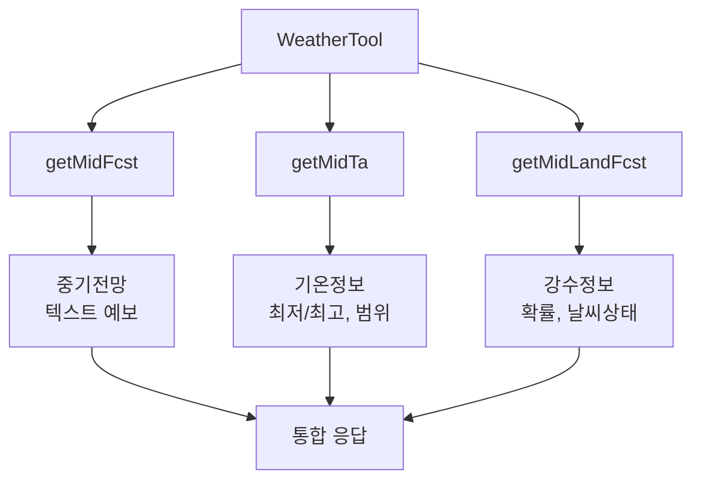
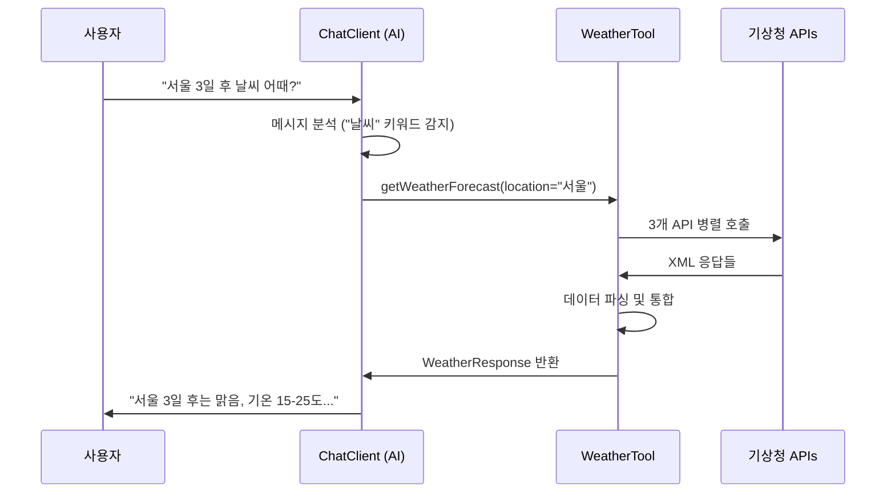

# 🌤️ Spring AI WeatherTool

Spring AI 1.0.1과 Groq API를 활용한 AI 기반 날씨 예보 서비스

## 📋 프로젝트 개요

이 프로젝트는 Spring AI의 `@Tool` 어노테이션을 사용하여 AI가 자동으로 호출할 수 있는 날씨 도구를 구현합니다. 기상청 API 3개를 통합하여 종합적인 중기 날씨 예보를 제공합니다.

### 🎯 주요 기능

- **🤖 AI 자동 호출**: Spring AI `@Tool` 어노테이션으로 AI가 필요시 자동 호출
- **🌐 3개 API 통합**: 기상청 중기예보 API 3개를 통합하여 종합적인 정보 제공
- **📍 지역 자동 인식**: 자연어에서 지역명을 추출하여 해당 지역 날씨 조회
- **📅 3-10일 예보**: 중기 날씨 예보 (3일 후부터 10일 후까지)
- **🌡️ 상세 기온 정보**: 최저/최고 기온 및 기온 범위 제공
- **🌧️ 강수 정보**: 오전/오후 강수확률 및 날씨 상태

## 🏗️ 프로젝트 구조

```
backend/
├── src/main/kotlin/com/back/
│   ├── application/
│   │   └── BackendApplication.kt          # 메인 애플리케이션 (dotenv 설정)
│   ├── config/
│   │   ├── AiConfig.kt                    # Spring AI ChatClient 설정
│   │   ├── SecurityConfig.kt              # Spring Security 비활성화
│   │   └── WebClientConfig.kt             # WebClient Bean 설정
│   ├── controller/
│   │   └── ChatController.kt              # REST API 엔드포인트
│   └── tool/
│       └── WeatherTool.kt                 # 핵심 날씨 툴 (@Tool 어노테이션)
├── src/main/resources/
│   └── application.yml                    # 애플리케이션 설정 (Groq API, 기상청 API)
├── build.gradle.kts                       # Gradle 빌드 설정
├── .env                                   # 환경변수 (API 키들)
└── README.md                              # 프로젝트 문서
```

## 🔧 기술 스택

### Core Framework
- **Spring Boot 3.5.5**: 메인 프레임워크
- **Spring AI 1.0.1**: AI 통합 및 Tool 기능
- **Spring WebFlux**: 비동기 HTTP 클라이언트
- **Kotlin 1.9.25**: 개발 언어

### AI & API Integration
- **Groq API**: AI 모델 (openai/gpt-oss-120b)
- **기상청 Open API**: 날씨 데이터 소스
- **Jackson XML**: XML 파싱

### Development Tools
- **dotenv-kotlin**: 환경변수 관리
- **Gradle**: 빌드 도구

## 📡 API 통합 구조

### 기상청 API 3개 통합



#### 1. getMidFcst (중기전망조회)
- **용도**: 기상청 공식 중기 전망 텍스트
- **데이터**: 일반인이 읽기 쉬운 날씨 설명
- **예시**: "맑은 날씨가 이어질 전망입니다"

#### 2. getMidTa (중기기온조회)
- **용도**: 3-10일 후 상세 기온 정보
- **데이터**: 최저/최고 기온, 기온 범위
- **예시**: 최저 15℃, 최고 25℃, 범위 13~17℃

#### 3. getMidLandFcst (중기육상예보조회)
- **용도**: 3-10일 후 강수 확률과 날씨 상태
- **데이터**: 오전/오후 강수확률, 날씨 상태
- **예시**: 오전 20%, 오후 30%, 맑음→구름많음

## 🚀 실행 방법

### 1. 환경 설정

`.env` 파일을 프로젝트 루트에 생성:

```env
GROQ_API_KEY=your_groq_api_key_here
WEATHER_API_KEY=your_weather_api_key_here
```

### 2. API 키 발급

#### Groq API 키
1. [Groq Console](https://console.groq.com/) 접속
2. API Key 생성
3. `openai/gpt-oss-120b` 모델 사용 가능 확인

#### 기상청 API 키
1. [기상청 Open API](https://www.data.go.kr/data/15084084/openapi.do) 접속
2. 중기예보조회서비스 신청
3. 서비스 키 발급 (승인까지 1-2일 소요)

### 3. 애플리케이션 실행

```bash
# 1. 의존성 설치 및 빌드
./gradlew build

# 2. 애플리케이션 실행
./gradlew bootRun
```

### 4. API 테스트

#### 브라우저에서 테스트
```
http://localhost:8080/chat?message=서울 날씨 어때?
http://localhost:8080/chat?message=부산 3일 후 날씨는?
```

#### cURL로 테스트
```bash
curl "http://localhost:8080/chat?message=제주도 날씨 알려줘"
```

## 🎯 동작 흐름

### 1. 사용자 요청
```
사용자: "서울 3일 후 날씨 어때?"
```

### 2. AI 분석 및 Tool 호출


### 3. 데이터 처리 과정
```
지역명 변환: "서울" → "11B10101" (지역코드)
발표시각 계산: 현재시간 → "202509161800" (최신 발표시각)
↓
3개 API 병렬 호출:
├── 중기전망: "맑은 날씨가 이어질 전망"
├── 기온정보: {day3: 15~25℃, day4: 16~26℃}
└── 강수정보: {day3: 오전20% 오후30%}
↓
데이터 통합 및 포맷팅:
"📋 기상 전망: 맑은 날씨가 이어질 전망
📅 3일 후 (09/19): 🌡️ 15℃~25℃ 🌧️ 오전 20% 오후 30%"
```

## 📊 데이터 구조

### WeatherResponse (최종 응답)
```kotlin
data class WeatherResponse(
    val region: String,          // "서울"
    val regionCode: String,      // "11B10101"
    val baseTime: String,        // "202509161800"
    val forecast: String,        // 통합 텍스트 요약
    val details: WeatherDetails  // 구조화된 상세 정보
)
```

### 응답 예시
```json
{
  "region": "서울",
  "regionCode": "11B10101",
  "baseTime": "202509161800",
  "forecast": "📋 기상 전망: 맑은 날씨가 이어질 전망입니다\n\n📅 3일 후 (09/19):\n  🌡️ 기온: 15℃~25℃\n  🌧️ 강수확률: 오전 20% 오후 30%\n  ☁️ 날씨: 오전 맑음 오후 구름많음",
  "details": {
    "day3": {
      "date": "09/19",
      "temperature": {
        "minTemp": 15,
        "maxTemp": 25,
        "minTempRange": "13~17℃",
        "maxTempRange": "23~27℃"
      },
      "precipitation": {
        "amRainPercent": 20,
        "pmRainPercent": 30,
        "amWeather": "맑음",
        "pmWeather": "구름많음"
      }
    }
  }
}
```

## 🌍 지원 지역

### 24개 주요 도시
```kotlin
"서울", "인천", "수원", "파주", "이천", "평택"     // 수도권
"춘천", "원주", "강릉", "속초"                    // 강원도
"대전", "세종", "청주", "충주"                    // 충청도
"전주", "군산", "광주", "목포", "여수"            // 전라도
"대구", "안동", "포항", "부산", "울산", "창원", "통영"  // 경상도
"제주", "서귀포"                                // 제주도
```

### 지역 매핑 시스템
- 사용자 입력 → 지역코드 변환 → API 호출
- 미등록 지역 입력시 서울로 기본 처리
- 향후 추가 지역 확장 가능

## ⚙️ 설정 정보

### application.yml
```yaml
spring:
  ai:
    openai:
      api-key: ${GROQ_API_KEY}
      base-url: https://api.groq.com/openai
      chat:
        options:
          model: openai/gpt-oss-120b
          temperature: 0.7
          max-tokens: 4096

weather:
  api:
    key: ${WEATHER_API_KEY}
    base-url: http://apis.data.go.kr/1360000/MidFcstInfoService
```

### 주요 설정 포인트
- **Groq API**: OpenAI 호환 엔드포인트 사용
- **기상청 API**: 중기예보조회서비스 전용
- **환경변수**: dotenv-kotlin으로 안전한 키 관리

## 🔧 개발 노트

### Map 기반 최적화
- 기존 day3~day10 개별 필드 → Map 기반 구조로 변경
- 중복 코드 제거 및 확장성 향상
- JSON 직렬화 호환성 유지

### 에러 처리
- API 실패시 빈 데이터 객체로 fallback
- 종합적인 로깅으로 디버깅 지원
- 일부 API 실패해도 나머지 데이터로 응답 제공

### 시간대 처리
- 기상청 API는 KST 기준 발표
- 현재 시간 기준으로 최신 발표시각 자동 계산
- 06시/18시 하루 2회 발표 스케줄 반영

## 🚀 확장 가능성

### 추가 기능 아이디어
- 🏖️ 해상예보 API 통합 (getMidSeaFcst)
- 🌡️ 체감온도 계산 추가
- 📈 날씨 변화 트렌드 분석
- 🔔 날씨 알림 기능
- 📍 GPS 기반 현재 위치 날씨

### 기술적 확장
- Redis 캐싱으로 API 호출 최적화
- GraphQL API 추가
- 실시간 WebSocket 날씨 업데이트
- Docker 컨테이너화