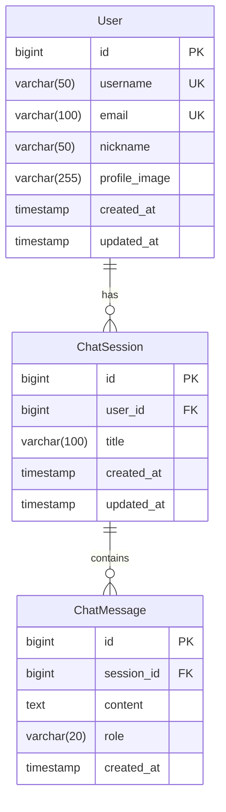

# 한국 여행 가이드 ERD

## 개요

이 문서는 한국 여행 가이드 애플리케이션의 데이터베이스 스키마를 정의합니다.
Spring AI 기반 챗봇 시스템으로, 사용자와 AI의 대화 이력을 관리합니다.

## ERD 다이어그램



## 테이블 상세 정의

### 1. User (사용자)

**목적**: 애플리케이션 사용자 정보 관리

| 컬럼명 | 타입 | 제약조건 | 설명 |
|--------|------|----------|------|
| id | BIGINT | PK, AUTO_INCREMENT | 사용자 고유 ID |
| username | VARCHAR(50) | UNIQUE, NOT NULL | 사용자명 (OAuth 기반) |
| email | VARCHAR(100) | UNIQUE, NOT NULL | 이메일 주소 |
| nickname | VARCHAR(50) | NOT NULL | 표시명 |
| profile_image | VARCHAR(255) | NULL | 프로필 이미지 URL |
| created_at | TIMESTAMP | NOT NULL, DEFAULT CURRENT_TIMESTAMP | 생성 시간 |
| updated_at | TIMESTAMP | NOT NULL, DEFAULT CURRENT_TIMESTAMP ON UPDATE CURRENT_TIMESTAMP | 수정 시간 |

**인덱스**:
- `idx_user_username` ON username
- `idx_user_email` ON email

### 2. ChatSession (채팅 세션)

**목적**: 사용자별 대화 세션 관리

| 컬럼명 | 타입 | 제약조건 | 설명 |
|--------|------|----------|------|
| id | BIGINT | PK, AUTO_INCREMENT | 세션 고유 ID |
| user_id | BIGINT | FK, NOT NULL | 사용자 ID (User.id 참조) |
| title | VARCHAR(100) | NULL | 세션 제목 (첫 번째 질문 기반) |
| created_at | TIMESTAMP | NOT NULL, DEFAULT CURRENT_TIMESTAMP | 생성 시간 |
| updated_at | TIMESTAMP | NOT NULL, DEFAULT CURRENT_TIMESTAMP ON UPDATE CURRENT_TIMESTAMP | 마지막 활동 시간 |

**외래키**:
- `fk_chat_session_user` FOREIGN KEY (user_id) REFERENCES User(id) ON DELETE CASCADE

**인덱스**:
- `idx_chat_session_user_created` ON (user_id, created_at)

### 3. ChatMessage (채팅 메시지)

**목적**: 대화 내용 저장 (사용자 질문, AI 응답)

| 컬럼명 | 타입 | 제약조건 | 설명 |
|--------|------|----------|------|
| id | BIGINT | PK, AUTO_INCREMENT | 메시지 고유 ID |
| session_id | BIGINT | FK, NOT NULL | 세션 ID (ChatSession.id 참조) |
| content | TEXT | NOT NULL | 메시지 내용 |
| role | VARCHAR(20) | NOT NULL | 메시지 역할 ('user', 'assistant') |
| created_at | TIMESTAMP | NOT NULL, DEFAULT CURRENT_TIMESTAMP | 생성 시간 |

**외래키**:
- `fk_chat_message_session` FOREIGN KEY (session_id) REFERENCES ChatSession(id) ON DELETE CASCADE

**인덱스**:
- `idx_chat_message_session_created` ON (session_id, created_at)
- `idx_chat_message_role` ON role

## 관계 설명

### User ↔ ChatSession (1:N)
- 한 사용자는 여러 개의 채팅 세션을 가질 수 있음
- 각 세션은 특정 주제나 시간대의 대화를 그룹화

### ChatSession ↔ ChatMessage (1:N)
- 한 세션은 여러 개의 메시지를 포함
- 메시지는 시간순으로 정렬되어 대화 흐름을 구성

## 데이터 예시

### User
```sql
INSERT INTO User (username, email, nickname, preferences) VALUES 
('john_doe', 'john@example.com', '존', '{"favorite_regions": ["서울", "부산"], "language": "ko"}');
```

### ChatSession
```sql
INSERT INTO ChatSession (user_id, title) VALUES 
(1, '서울 날씨 문의');
```

### ChatMessage
```sql
INSERT INTO ChatMessage (session_id, content, role) VALUES
(1, '서울 날씨 어때?', 'user'),
(1, '서울의 현재 날씨를 조회해드리겠습니다. 현재 서울은 맑은 날씨이며...', 'assistant');
```

## 캐시 전략

**데이터베이스 외부 캐시 (Redis)**:
- `weather:{regionCode}:{baseTime}` → 기상 정보 (TTL: 1시간)
- `tour:{areaCode}:{page}` → 관광지 정보 (TTL: 24시간)
- `user_session:{userId}` → 활성 세션 정보 (TTL: 30분)

## 성능 최적화

### 파티셔닝 전략
- `ChatMessage` 테이블: 월별 파티셔닝 (대용량 메시지 데이터)
- `ChatSession` 테이블: 연도별 파티셔닝 (장기 보관)

### 아카이빙
- 90일 이상 된 비활성 세션: 아카이브 테이블로 이동
- 1년 이상 된 메시지: 압축 저장

## 확장 계획

향후 기능 추가 시 고려사항:

1. **UserFavorites** 테이블 추가 (즐겨찾기 지역)
2. **TravelPlan** 테이블 추가 (여행 계획 저장)
3. **Feedback** 테이블 추가 (AI 응답 평가)
4. **AdminLog** 테이블 추가 (관리자 작업 로그)

## 마이그레이션

현재 스키마는 JPA Entity로 관리되며, Flyway를 통한 버전 관리 예정.

---

**생성일**: 2025-09-16  
**작성자**: 개발팀  
**버전**: 1.0