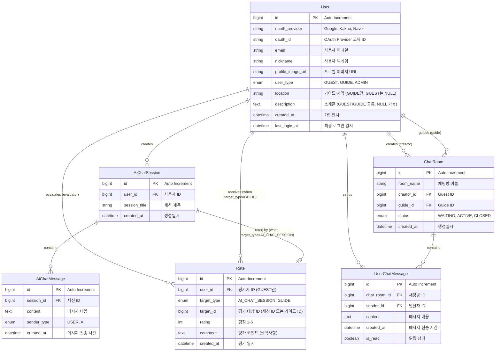

# 한국 여행 가이드 서비스 ERD

## 개요
한국 여행 가이드 서비스의 MVP(Minimum Viable Product) 데이터베이스 설계입니다.
OAuth 기반 인증, AI 채팅, Guest-Guide 매칭 기능을 지원하는 **도메인 분리** 구조로 설계되었습니다.

## 도메인 분리 아키텍처

### AI Chat 도메인 (aichat/)
- 사용자 ↔ Spring AI 대화
- 여행/날씨 정보 제공
- 세션 기반 대화 관리

### User Chat 도메인 (messaging/)
- Guest ↔ Guide 실시간 채팅
- WebSocket + STOMP 기반
- 1:1 매칭 시스템

## ERD 다이어그램



## 엔티티 상세 설명

### 공통 엔티티

#### 1. User (사용자)
모든 도메인에서 공유하는 사용자 정보 테이블입니다.

| 컬럼명 | 타입 | 제약조건 | 설명 |
|--------|------|----------|------|
| id | BIGINT | PK, AUTO_INCREMENT | 사용자 고유 식별자 |
| oauth_provider | VARCHAR(50) | NOT NULL | OAuth 제공자 (google, kakao, naver) |
| oauth_id | VARCHAR(100) | NOT NULL | OAuth 제공자별 고유 ID |
| email | VARCHAR(255) | NOT NULL, UNIQUE | 사용자 이메일 |
| nickname | VARCHAR(50) | NOT NULL | 사용자 닉네임 |
| profile_image_url | VARCHAR(500) | NULL | 프로필 이미지 URL |
| user_type | ENUM | NOT NULL | 사용자 유형 (GUEST, GUIDE, ADMIN) |
| location | VARCHAR(100) | NULL | 가이드 활동 지역 (GUIDE만 사용) |
| description | TEXT | NULL | 사용자 소개글 (GUEST/GUIDE 공통) |
| created_at | DATETIME | NOT NULL | 가입 일시 |
| last_login_at | DATETIME | NULL | 최종 로그인 일시 |

**제약조건:**
- UNIQUE KEY: (oauth_provider, oauth_id)
- INDEX: email, user_type

### AI Chat 도메인

#### 2. AiChatSession (AI 채팅 세션)
사용자와 AI 간의 대화 세션을 관리하는 테이블입니다.

| 컬럼명 | 타입 | 제약조건 | 설명 |
|--------|------|----------|------|
| id | BIGINT | PK, AUTO_INCREMENT | 세션 고유 식별자 |
| user_id | BIGINT | FK, NOT NULL | 사용자 ID |
| session_title | VARCHAR(100) | NULL | 세션 제목 (첫 질문 기반) |
| created_at | DATETIME | NOT NULL | 생성 일시 |

**제약조건:**
- FK: user_id → User(id)
- INDEX: (user_id, created_at)

#### 3. AiChatMessage (AI 채팅 메시지)
AI 채팅 메시지를 저장하는 테이블입니다.

| 컬럼명 | 타입 | 제약조건 | 설명 |
|--------|------|----------|------|
| id | BIGINT | PK, AUTO_INCREMENT | 메시지 고유 식별자 |
| session_id | BIGINT | FK, NOT NULL | 세션 ID |
| content | TEXT | NOT NULL | 메시지 내용 |
| sender_type | ENUM | NOT NULL | 발신자 유형 (USER, AI) |
| created_at | DATETIME | NOT NULL | 메시지 전송 시간 |

**제약조건:**
- FK: session_id → AiChatSession(id)
- INDEX: (session_id, created_at)

### User Chat 도메인

#### 4. ChatRoom (유저 채팅방)
Guest와 Guide 간의 채팅방을 관리하는 테이블입니다.

| 컬럼명 | 타입 | 제약조건 | 설명 |
|--------|------|----------|------|
| id | BIGINT | PK, AUTO_INCREMENT | 채팅방 고유 식별자 |
| room_name | VARCHAR(100) | NOT NULL | 채팅방 이름 |
| creator_id | BIGINT | FK, NOT NULL | Guest ID (채팅방 생성자) |
| guide_id | BIGINT | FK, NOT NULL | Guide ID |
| status | ENUM | NOT NULL | 채팅방 상태 (WAITING, ACTIVE, CLOSED) |
| created_at | DATETIME | NOT NULL | 생성 일시 |

**제약조건:**
- FK: creator_id → User(id)
- FK: guide_id → User(id)
- INDEX: (creator_id, status), (guide_id, status)

#### 5. UserChatMessage (유저 채팅 메시지)
Guest-Guide 간 채팅 메시지를 저장하는 테이블입니다.

| 컬럼명 | 타입 | 제약조건 | 설명 |
|--------|------|----------|------|
| id | BIGINT | PK, AUTO_INCREMENT | 메시지 고유 식별자 |
| chat_room_id | BIGINT | FK, NOT NULL | 채팅방 ID |
| sender_id | BIGINT | FK, NOT NULL | 발신자 ID |
| content | TEXT | NOT NULL | 메시지 내용 |
| created_at | DATETIME | NOT NULL | 메시지 전송 시간 |
| is_read | BOOLEAN | NOT NULL, DEFAULT FALSE | 읽음 상태 |

**제약조건:**
- FK: chat_room_id → ChatRoom(id)
- FK: sender_id → User(id)
- INDEX: (chat_room_id, created_at)

#### 6. Rate (평가)
Guest가 AI 채팅 세션과 채팅방을 평가하는 테이블입니다.

| 컬럼명 | 타입 | 제약조건 | 설명 |
|--------|------|----------|------|
| id | BIGINT | PK, AUTO_INCREMENT | 평가 고유 식별자 |
| user_id | BIGINT | FK, NOT NULL | 평가자 ID (GUEST만) |
| target_type | ENUM | NOT NULL | 평가 대상 타입 (AI_CHAT_SESSION, GUIDE) |
| target_id | BIGINT | NOT NULL | 평가 대상 ID (세션 ID 또는 가이드 ID) |
| rating | INT | NOT NULL | 평점 1-5 |
| comment | TEXT | NULL | 평가 코멘트 (선택사항) |
| created_at | DATETIME | NOT NULL | 평가 일시 |

**제약조건:**
- FK: user_id → User(id) (평가자)
- FK: target_id → User(id) WHEN target_type = 'GUIDE' (가이드)
- FK: target_id → AiChatSession(id) WHEN target_type = 'AI_CHAT_SESSION' (세션)
- INDEX: (target_type, target_id), (user_id, created_at)
- CHECK: rating BETWEEN 1 AND 5
- UNIQUE KEY: (target_type, target_id) WHEN target_type = 'AI_CHAT_SESSION' (AI 세션 중복 평가 방지)
- UNIQUE KEY: (user_id, target_type, target_id) WHEN target_type = 'GUIDE' (가이드 중복 평가 방지)

**비즈니스 룰:**
- AI 세션 평가: 세션 소유자만 평가 가능 (Rate.user_id = AiChatSession.user_id)
- 가이드 평가: GUEST만 평가 가능 (Rate.user_id의 user_type = 'GUEST')
- AI 세션당 최대 1개 평가, 가이드당 사용자별 1개 평가

## 설계 원칙 및 특징

### 1. 도메인 분리 설계
- **AI Chat 도메인**: aichat/ 패키지로 분리
- **User Chat 도메인**: messaging/ 패키지로 분리
- **공통 User**: 두 도메인에서 공유
- **독립적 진화**: 각 도메인별 독립적 개발 가능

### 2. MVP 중심 설계
- **최소 기능만 포함**: 핵심 채팅 기능에 집중
- **확장 가능성 고려**: 향후 기능 추가 시 테이블 추가 방식
- **복잡성 제거**: 불필요한 정규화 및 관계 최소화

### 3. OAuth 전용 인증
- **패스워드 없음**: OAuth만으로 인증 처리
- **소셜 로그인**: Google, Kakao, Naver 지원
- **프로필 연동**: 소셜 계정 프로필 이미지 활용

### 4. 기술 스택 분리
- **AI Chat**: Spring AI + SSE 스트리밍
- **User Chat**: WebSocket + STOMP 실시간 통신
- **Tour/Weather**: 서비스 레이어만 존재 (DB 저장 X)

## 데이터 플로우

### AI 채팅 플로우
```
1. User → AiChatSession 생성
2. User → AiChatMessage 전송
3. Spring AI → WeatherTool/TourTool 호출
4. AI → AiChatMessage(sender_type=AI) 생성
5. SSE로 실시간 응답 전송
```

### Guest-Guide 채팅 플로우
```
1. Guest → ChatRoom 생성 (status=WAITING)
2. Guide 매칭 → status=ACTIVE
3. 양쪽 클라이언트 WebSocket 연결 + /topic/chat/{roomId} 구독
4. 메시지 전송 → UserChatMessage DB 저장 + WebSocket 전송
5. 상대방 실시간 수신 + is_read 상태 관리
```

## 확장 계획

### Phase 2 (향후 추가 예정)
- **Review 시스템**: 가이드 평가 기능
- **Favorite 시스템**: 관광지 즐겨찾기
- **Group Chat**: 다중 사용자 채팅방
- **File Upload**: 이미지/파일 첨부

### Phase 3 (장기 계획)
- **Payment 시스템**: 가이드 서비스 결제
- **Location 추적**: 실시간 위치 공유
- **Push Notification**: 실시간 알림
- **Analytics**: 사용자 행동 분석

## 성능 고려사항

### 인덱스 설계
```sql
-- 자주 조회되는 컬럼에 인덱스 생성
CREATE INDEX idx_user_email ON User(email);
CREATE INDEX idx_user_type ON User(user_type);
CREATE INDEX idx_chatroom_creator ON ChatRoom(creator_id);
CREATE INDEX idx_chatroom_guide ON ChatRoom(guide_id);
CREATE INDEX idx_chatmessage_room_time ON ChatMessage(chat_room_id, created_at);
```

### 캐싱 전략
- **WeatherService**: @Cacheable(30분)
- **TourService**: @Cacheable(1시간)
- **ChatMessage**: Redis 캐싱 고려

### 실시간 처리
- **AI Chat**: SSE (Server-Sent Events) 스트리밍
- **User Chat**: WebSocket + STOMP 양방향 통신
- **Message Queue**: 대용량 메시지 처리 시 RabbitMQ/Kafka 도입 검토

## 도메인별 기술 스택

### AI Chat 도메인 (aichat/)
```
Controller: @RestController + SSE
Service: Spring AI ChatClient + Tool
Entity: AiChatSession, AiChatMessage
기술: Spring AI, SSE, @Cacheable
```

### User Chat 도메인 (messaging/)
```
Controller: @MessageMapping + WebSocket
Service: 매칭, 채팅방 관리
Entity: ChatRoom, UserChatMessage
기술: WebSocket, STOMP, Redis(선택)
```

---

**생성일**: 2025-01-24
**작성자**: 개발팀
**버전**: 2.0 (MVP)