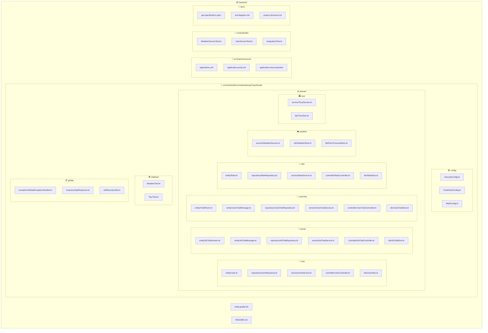
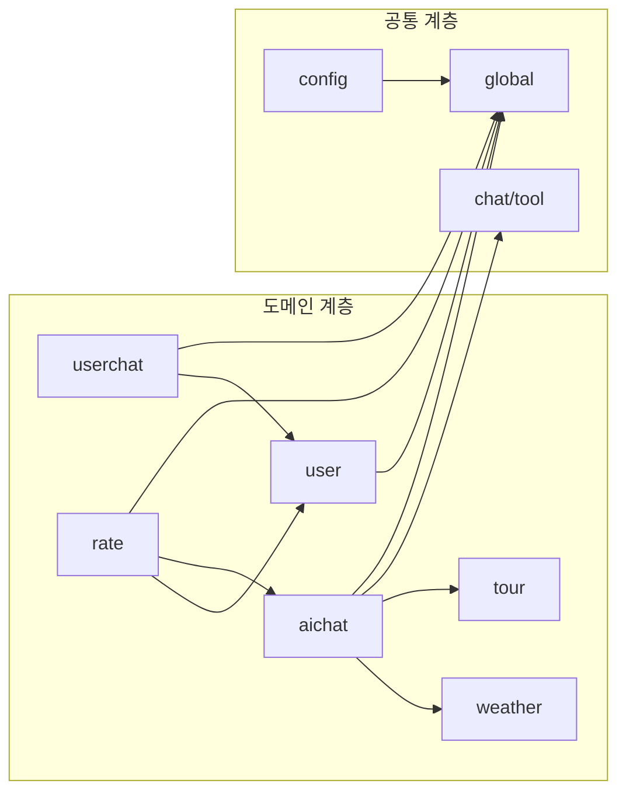

# 한국 여행 가이드 서비스 프로젝트 구조

## 개요
도메인 분리 아키텍처(DDD)를 적용한 Spring Boot Kotlin 프로젝트 구조입니다.
OAuth 인증, AI 채팅, 사용자 채팅, 평가 시스템을 도메인별로 분리하여 관리합니다.

## 프로젝트 구조 다이어그램



## 도메인별 상세 구조

### 1. 사용자 도메인 (user/)
```
user/
├── entity/
│   └── User.kt                    # 사용자 엔티티 (GUEST, GUIDE, ADMIN)
├── repository/
│   └── UserRepository.kt          # JPA Repository
├── service/
│   └── UserService.kt             # OAuth 로그인, 프로필 관리
├── controller/
│   └── UserController.kt          # 인증, 프로필 API
└── dto/
    ├── LoginRequest.kt
    ├── UserResponse.kt
    └── ProfileResponse.kt
```

### 2. AI 채팅 도메인 (aichat/)
```
aichat/
├── entity/
│   ├── AiChatSession.kt           # AI 채팅 세션
│   └── AiChatMessage.kt           # AI 채팅 메시지
├── repository/
│   ├── AiChatSessionRepository.kt
│   └── AiChatMessageRepository.kt
├── service/
│   └── AiChatService.kt           # Spring AI 통합, 세션 관리
├── controller/
│   └── AiChatController.kt        # AI 채팅 API, SSE 스트리밍
└── dto/
    ├── SessionRequest.kt
    ├── MessageRequest.kt
    └── AiChatResponse.kt
```

### 3. 사용자 채팅 도메인 (userchat/)
```
userchat/
├── entity/
│   ├── ChatRoom.kt                # Guest-Guide 채팅방
│   └── UserChatMessage.kt         # 사용자 간 메시지
├── repository/
│   ├── ChatRoomRepository.kt
│   └── UserChatMessageRepository.kt
├── service/
│   └── UserChatService.kt         # 매칭, 메시지 처리
├── controller/
│   └── UserChatController.kt      # 채팅방 관리 API
└── dto/
    ├── CreateRoomRequest.kt
    ├── MessageRequest.kt
    └── ChatRoomResponse.kt
```

### 4. 평가 도메인 (rate/)
```
rate/
├── entity/
│   └── Rate.kt                    # 평가 엔티티 (AI세션/가이드 평가)
├── repository/
│   └── RateRepository.kt          # JPA Repository
├── service/
│   └── RateService.kt             # 평가 생성, 평균 계산
├── controller/
│   └── RateController.kt          # 평가 API
└── dto/
    ├── RateRequest.kt
    ├── RateResponse.kt
    └── GuideRatingResponse.kt
```

### 5. 날씨 도메인 (weather/)
```
weather/
├── service/
│   └── WeatherService.kt          # 기상청 API 연동
└── dto/
    ├── WeatherResponse.kt         # 날씨 응답 DTO
    └── MidTermForecastDtos.kt     # 중기예보 DTO
```

### 6. 관광 도메인 (tour/)
```
tour/
├── service/
│   └── TourService.kt             # 관광 정보 API 연동
└── dto/
    └── TourResponse.kt            # 관광 정보 응답 DTO
```

## 기술 스택별 파일 구조

### Spring AI 통합
```
chat/tool/
├── WeatherTool.kt                 # Spring AI 날씨 도구
└── TourTool.kt                    # Spring AI 관광 도구

config/
└── ChatClientConfig.kt            # OpenAI ChatClient 설정
```

### 보안 및 인증
```
config/
├── SecurityConfig.kt              # Spring Security 설정
└── OAuth2Config.kt                # OAuth2 클라이언트 설정

global/
├── exception/
│   └── GlobalExceptionHandler.kt  # 전역 예외 처리
└── util/
    └── SecurityUtils.kt           # JWT 유틸리티
```

### 데이터베이스
```
# H2 Database (개발/테스트용)
resources/
├── application.yml                # 기본 설정
├── application-prod.yml           # 운영 환경 설정
└── application-test.properties    # 테스트 환경 설정
```

## API 엔드포인트 매핑

| 도메인 | 컨트롤러 | API 경로 | 설명 |
|--------|----------|----------|------|
| **user** | UserController | `/api/users/*` | OAuth 로그인, 프로필 관리 |
| **aichat** | AiChatController | `/api/aichat/*` | AI 채팅, 세션 관리 |
| **userchat** | UserChatController | `/api/userchat/*` | Guest-Guide 채팅 |
| **rate** | RateController | `/api/rate/*` | AI/가이드 평가 시스템 |

## 의존성 구조



## 빌드 및 배포

### Gradle 구조
```
build.gradle.kts                   # 메인 빌드 스크립트
├── Kotlin JVM 1.9.25
├── Spring Boot 3.5.5
├── Spring AI 1.0.1
├── Spring Security + OAuth2
├── Spring Data JPA
├── H2 Database
├── Jackson (JSON/XML)
├── Swagger OpenAPI 3.0
└── ktlint (코드 스타일)
```

### 환경별 설정
- **개발**: H2 인메모리 DB, 로컬 OpenAI API
- **테스트**: H2 테스트 DB, Mock API
- **운영**: 외부 DB, 실제 API 키

## 패키지 명명 규칙

- **Entity**: `도메인.entity.*`
- **Repository**: `도메인.repository.*Repository`
- **Service**: `도메인.service.*Service`
- **Controller**: `도메인.controller.*Controller`
- **DTO**: `도메인.dto.*Dto` / `*Request` / `*Response`
- **Exception**: `global.exception.*Exception`

---

**생성일**: 2025-01-24
**작성자**: 개발팀
**버전**: 2.0 (MVP + Rate Domain)